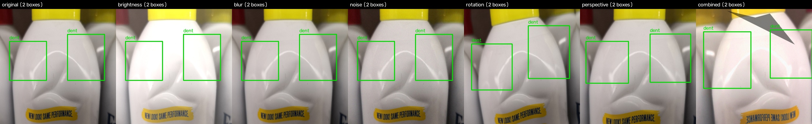
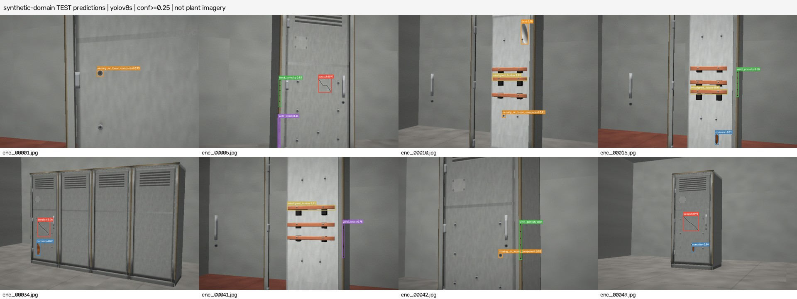

# Computer Vision Quality Inspection Prototype

A public, reproducible implementation of a manufacturing visual-inspection pipeline for switchgear-style electrical enclosures and related metal assemblies.

The system uses YOLOv8 for defect localization/classification, a configurable confidence-policy layer for PASS/FAIL decisions, SQL logging for traceability, Power BI-friendly exports, and an ONNX -> TensorRT -> Jetson deployment path.

> **Scope:** this repository is a public-data prototype. It does not contain proprietary plant imagery and should not be treated as a production inspection model.

## What the system does

```text
camera / image
    -> YOLOv8 detector
    -> class + box + confidence
    -> per-class threshold policy
    -> PASS / FAIL
    -> SQL inspection log
    -> dashboard export
```

The seven prototype classes are:

1. `scratch`
2. `dent`
3. `weld_porosity`
4. `weld_crack`
5. `corrosion`
6. `misaligned_busbar`
7. `missing_or_loose_component`

## Why YOLOv8

This is an object-detection problem, not only an image-classification problem: the inspector needs both **what** the defect is and **where** it is.

YOLOv8 was selected for the prototype because it provides a practical speed/accuracy tradeoff, a mature training/inference API, and a straightforward export path to ONNX and NVIDIA TensorRT. A classifier would not localize the defect; segmentation could be more precise but requires substantially more annotation effort.

## Data strategy

Public industrial defect imagery is limited, especially for switchgear-specific assembly defects. This repository keeps data provenance explicit rather than silently treating unrelated images as factory data.

There are two primary data domains:

| Domain | Purpose | Size | Notes |
| --- | --- | ---: | --- |
| Licensed photographs | domain-gap / public-data baseline | 27 collected, 22 labeled | Wikimedia Commons; sparse and not representative of a real plant |
| Procedural shop-inspection renders | end-to-end detector prototype | 700 images | synthetic cabinets with deterministic defect masks; 490/105/105 train/val/test |

Every public-image source and license note is tracked in `data/sources.csv`. The collection tool downloads only URLs supplied in a manifest; it is not an uncontrolled crawler.

See `docs/DATA_STRATEGY.md`, `docs/DATASET.md`, and `docs/DOMAIN_GAP.md`.

The original shop renderer, its portable launcher, and verification commands are
now included. See [shop generator reproducibility](scripts/shop_inspect/README.md).
See [final verification](docs/FINAL_REVIEW.md) for the checks, fixes, and limits
of the current build.

## Augmentation

Augmentation is applied to **training data only**. Validation and test images are left untouched except for deterministic model preprocessing.

The policy simulates realistic acquisition variation:

- brightness / contrast / gamma -> shop-floor lighting
- blur / motion blur -> focus and vibration
- Gaussian noise -> sensor variation
- small rotation / perspective -> camera-mount variation
- small scale / translation -> distance and framing variation
- mild color changes -> camera / illumination differences

The policy intentionally avoids extreme transforms that would create physically implausible inspection scenes.



Run:

```bash
python scripts/preview_augmentations.py \
  --image data/train/images/Metal_Dented_Defect.jpg \
  --labels data/train/labels/Metal_Dented_Defect.txt \
  --output outputs/augmentation_preview.jpg
```

## Training and evaluation

The repository keeps synthetic-domain results separate from photo-domain results.

### Procedural shop-inspection benchmark

The included YOLOv8s checkpoint was trained for 40 epochs on the 700 procedural shop renders and evaluated on the untouched 105-image synthetic test split.

| Metric | Held-out synthetic test |
| --- | ---: |
| Precision | 0.9839 |
| Recall | 0.9826 |
| F1 | 0.9832 |
| mAP@0.5 | 0.9932 |
| mAP@0.5:0.95 | 0.8781 |

These numbers demonstrate that the end-to-end pipeline can learn the rendered defect taxonomy. **They are not plant-performance claims.**



### Public-photo domain gap

The synthetic checkpoint was also run on licensed real photographs. Generalization is poor: boxes frequently land on seams, handles, meters, shadows, or other visual structure rather than the intended defect class.

That result is useful because it exposes the key deployment constraint: synthetic performance is not sufficient. A real implementation needs plant-owned images, stable camera/lighting conditions, reviewed labels, threshold calibration, and shadow-mode validation.

See `docs/DOMAIN_GAP.md` for the detailed inspection.

## Confidence thresholds and PASS/FAIL

A detection triggers `FAIL` only when its confidence exceeds the configured threshold for that class.

`configs/thresholds.yaml` contains **example** values only. They are not calibrated plant operating points.

The reason to use per-class thresholds is risk asymmetry: missing a weld crack or missing component may justify a lower threshold than a cosmetic scratch.

```bash
python scripts/analyze_thresholds.py
```

A production threshold would be selected from validation curves together with the business cost of a missed defect versus a false reject.

## Inference

Single image:

```bash
python infer.py \
  --image data/shop/images/test/<image>.jpg \
  --weights outputs/training/yolov8_shop/weights/best.pt
```

Explicit mock/demo mode:

```bash
python infer.py --demo --image data/sample/rusty_steel_plate_preview.jpg --no-log
```

Mock output is visibly stamped and never presented as model inference.

## API

```bash
uvicorn app:app --host 0.0.0.0 --port 8000
```

- `GET /health`
- `POST /predict` with a multipart image

The model is loaded once per process. Set `MODEL_WEIGHTS` and `MODEL_DEVICE` to change the runtime checkpoint/device.
Missing weights return HTTP 503. Mock API predictions require explicitly setting
`MODEL_MOCK=1`; every mock response is marked `mock: true`.

Video and webcam CLI inputs currently inspect the first frame as a smoke check;
continuous camera capture and station integration remain deployment work.

## SQL logging and dashboard output

Inference can log two relational entities through SQLAlchemy:

- `inspections`: timestamp, image, model version, PASS/FAIL, max confidence, inference time, device
- `detections`: class, confidence, bounding box, linked inspection id

SQLite is the local default. A SQL Server deployment can use the same data model by changing `INSPECTION_DATABASE_URL`.

```bash
python scripts/show_recent_inspections.py
python scripts/export_dashboard_data.py
```

The dashboard export contains inspection throughput, pass/fail rate, defect counts, average confidence, and inference latency for Power BI or another BI layer.

## ONNX / TensorRT / Jetson path

```text
PyTorch checkpoint
    -> ONNX
    -> TensorRT engine
    -> NVIDIA Jetson
    -> camera inference
```

```bash
python export_onnx.py --weights outputs/training/yolov8_shop/weights/best.pt --imgsz 640
```

The included ONNX export loads successfully. TensorRT/Jetson benchmarking requires NVIDIA hardware and is not claimed by this public build.

See `docs/EDGE_DEPLOYMENT.md`.

## Productionization

A real switchgear deployment would require:

1. plant-owned imagery from the actual enclosure / busbar families
2. defect taxonomy signed off by quality engineering
3. fixed camera, lens, working distance, and illumination
4. a reviewed golden validation set
5. per-defect severity and threshold calibration
6. shadow-mode comparison against human inspection
7. operator override and full audit trail
8. drift / reject-rate monitoring
9. retraining when design, supplier, camera, or lighting changes
10. IT/OT cybersecurity review before integration with plant systems

See `docs/PRODUCTIONIZATION.md`.

## Repository map

```text
train.py                    training entry point
evaluate.py                 dataset-aware evaluation
infer.py                    image / folder / video inference
app.py                      FastAPI service
export_onnx.py              ONNX export and validation
inspection/                 shared inference, thresholds, labels, validation
scripts/                    collection, cleaning, splitting, augmentation, analysis
configs/                    dataset, training, threshold configuration
data/                       provenance + public / synthetic datasets
db/                         SQLAlchemy logging models
docs/                       architecture, model card, data, deployment notes
tests/                      CPU-safe unit tests
outputs/                    selected reproducibility artifacts
```

## Quick start

```bash
python -m venv .venv
source .venv/bin/activate
pip install -r requirements.txt

pytest

# Validate the public-photo split
python scripts/validate_dataset.py
python scripts/dataset_stats.py

# Train on a selected dataset
python train.py --config configs/train.yaml --data configs/data_wikimedia.yaml --run-name yolov8_photo_new

# Evaluate the same selected dataset
python evaluate.py \
  --weights outputs/training/yolov8_photo_new/weights/best.pt \
  --data configs/data_wikimedia.yaml \
  --device cpu

# Run the included shop-inspection checkpoint
python infer.py \
  --image data/shop/images/test/enc_00001.jpg \
  --weights outputs/training/yolov8_shop/weights/best.pt
```

The Linux install uses CPU PyTorch wheels; macOS and Windows use standard
platform wheels. Training refuses to replace an existing run directory; choose
a fresh `--run-name`. The included checkpoints can be used without retraining.

## Limitations

- Public photo coverage is sparse and does not reproduce a real switchgear plant distribution.
- Several target classes have little or no useful photo-domain annotation.
- Synthetic renders simplify texture, geometry, defect formation, and camera conditions.
- The included example thresholds are not plant-calibrated.
- No Jetson/TensorRT latency benchmark is claimed here.
- Safety-critical quality decisions should not rely on an unvalidated model.

The purpose of this repository is to make the **engineering path reproducible**: provenance -> annotation -> split -> augmentation -> transfer learning -> evaluation -> threshold policy -> inference -> audit logging -> edge deployment.
